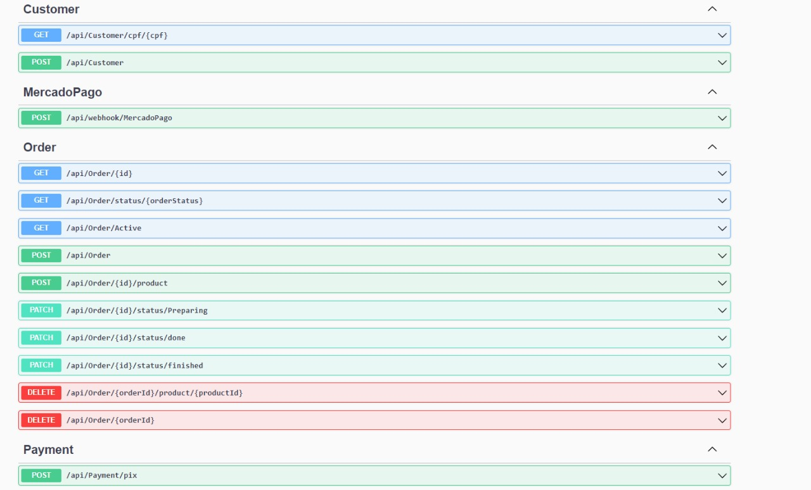
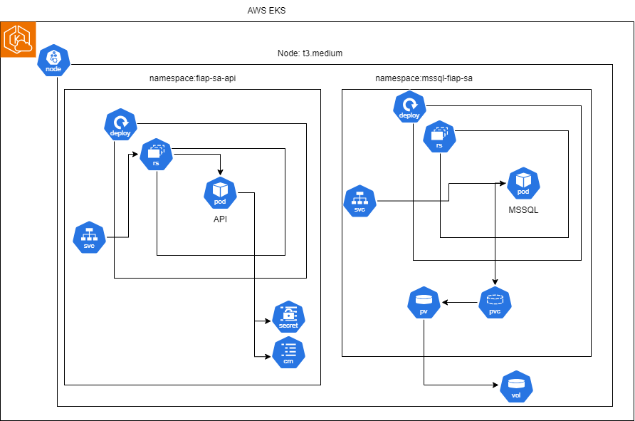

# MBA em Software Architecture @ FIAP

## Turma 7 - Grupo 48: Lanchonete API

Bem-vindo a API da Lanchonete! 

A API foi desenvolvida em .NET 8 e sua persistência esta sendo feita em um banco de dados SQL Servet. 
Toda a execução da aplicação e sua infraestrutura pode ser feita através de containers Docker. Você encontrará um arquivo chamado ``docker-compose.yaml`` na raiz do repositório com a declaracão dos serviços necessários para a execução da aplicação e suas dependências. 
A aplicação fornece uma interface para utilizacao das APIs através do componente Swagger UI.

### Tecnologias Utilizadas

- .NET 8
- SQL Server
- Docker
- Swagger

## Funcionalidades

- Criar, editar remover produtos
- Buscar produtos por categoria(s)
- Cadastro de clientes
- Identificação de cliente via CPF
- Fake checkout, apenas enviar os produtos escolhidos para a fila. O checkout é a finalização do pedido.
- Listar pedidos.

## Pré-requisitos

Antes de começar, você vai precisar ter instalado em sua máquina as seguintes ferramentas:

- [Docker](https://www.docker.com/get-started)

## Como Rodar a Aplicação

### 1. Clone este repositório

```bash
git clone https://github.com/rudironsonijr/fiap-pos-software-architecture-tech-challenge-turma-7-grupo-48.git

cd fiap-pos-software-architecture-tech-challenge-turma-7-grupo-48
```

### Execute através do Docker Compose

```bash
docker compose up -d
```

Após subir os containers, a API estará disponível em http://localhost:5000. 
A partir desse momento, você poderá acessar a interface do Swagger em http://localhost:5000/swagger.



## Documentação do Event Storm e Swagger
- [Link para acesso do Event Storm](https://miro.com/app/board/uXjVKU1AvvI=/?share_link_id=847516420738)


## Desenho da Infraestrutura


## Link para o vídeo 
https://youtu.be/iHuTgzF_PCA